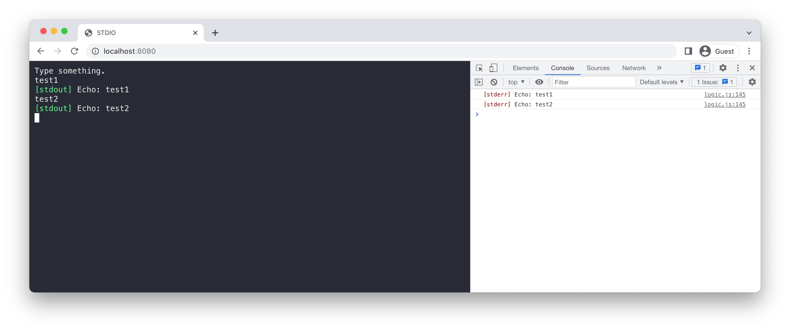

# Standard Input and Output in Emscripten

## Description

Simple demo on how to tackle blocking standard input/output when wrapping native command line programs in WebAssembly.



## How to build and run

### Native version

```
mkdir build
cd build
cmake ..
make
./stdio-demo
```

### Web version

First set up Emscripten as instructed [here](https://emscripten.org/docs/getting_started/downloads.html).

```
mkdir build-wasm
cd build-wasm
emcmake cmake ..
make
../run_server.py
```

Now open http://localhost:8080/.
